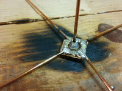
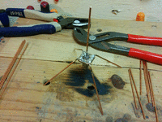
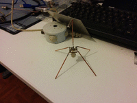
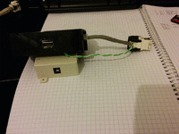
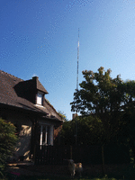
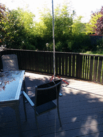
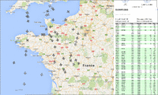

# Reception ADS-B
:toc:
:stylesheet: ../boot-slate.css

## Construction de l'antenne

Fabrication d'une antenne "ground plane" à partir d'une embase BNC et de fil de cuivre monobrin.

Utilisation d'un fer à flamme fortemment recommandée pour vaincre l'inertie thermique du BNC.

.Soudure des deux premiers elements
[link=IMG_20150907_195005.jpg]
image::thumbs/IMG_20150907_195005.gif[]

.Rajout des deux autres brins du ground plane
[link=IMG_20150907_195908.jpg]

.Pliage des éléments du plan de masse
[link=IMG_20150907_201831.jpg]

.Autre vue de l'antenne terminée
[link=IMG_20150907_230328.jpg]

## Installation du récepteur

.Injecteur PoE passif pour RPi
[link=IMG_20150908_214543.jpg]

.Installation de l'antenne en tête de mat
[link=IMG_20150920_113312.jpg]

.Vue sur le pied et la base
[link=IMG_20150920_124348.jpg]

.Vue avec le SDR alimenté via rallonge usb active
[link=IMG_20150920_124358.jpg]
image::thumbs/IMG_20150920_124358.gif[]

## Réception et couverture

On est pas mal je dirais !

.dump1090

