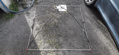
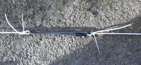
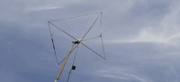
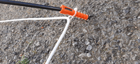
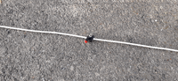
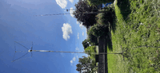
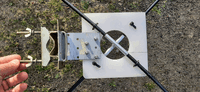
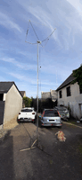
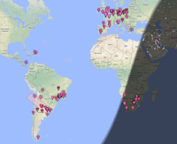

# 10m Square halo antenna
:toc:
:stylesheet: ../boot-slate.css

## Construction de l'antenne

Construction tirée du site de https://www.pa9x.com/how-to-build-10-and-20-meter-band-square-halo-antenna/[PA9X], en version monobande.

Cette antenne est un dipôle replié, rapide et peu cher à fabriquer.

.Antenne au sol après construction
[link=20220506_192039.jpg]

.Vue d'ensemble antenne installée
[link=20220507_172659.jpg]
image::thumbs/20220507_172659.gif[]

.Raccord non conducteur entre les deux brins du dipôle replié
[link=20220506_192048.jpg]

.Antenne en l'air vue de dessous
[link=20220506_191411.jpg]

.Vue au vna à la fréquence de résonance (trop basse)
[link=20220506_191402.jpg]
image::thumbs/20220506_191402.gif[]

.Détail sur la fixation du cable d'antenne sur les chevilles emmanchées sur les joncs en fibre
[link=20220506_192137.jpg]

.Antenne installée sur le pied
[link=20220506_191501.jpg]
image::thumbs/20220506_191501.gif[]

.Detail du raccord bnc-banane
[link=20220506_192100.jpg]

.Vue in situ
[link=20220507_172703.jpg]

.Detail sur le système de fixation
[link=20220506_192128.jpg]

.Premiere installation temporaire
[link=20220506_191511.jpg]

## tests en FT8

.Réception
[link=ft8_rx_20220507_182744.png]

.Emission avec 20w
[link=ft8_tx_20W_20220507_182744.png]
image::thumbs/ft8_tx_20W_20220507_182744.gif[]
