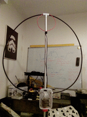
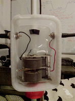
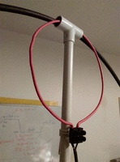

# Magloop antenna
:stylesheet: ../boot-slate.css

## Antenne à boucle magnétique de fabrication OM

Antenne de fabrication maison uniquement avec des composants de récupération. 

Condensateur variable à air récupéré sur une vieille radio à tubes Oceanic, entre 16,8 et 250pF entre les deux stators (configuration utilisée), ou 25-500pF entre rotor et stator.

Grande boucle réalisée en TWB4001 (équivalent LMR400), raccordement sur la tresse de ⌀8,05mm. L'ame est laissée flottante. Petite boucle en fil électrique multibrin 6mm² reliée au domino de raccordement du coaxial.

Specs::

* Grande boucle : 2,65m (~⌀ 84cm)
* Petite boucle : 60cm (~⌀ 23cm)
* Fmin à 250pF : 6,04Mhz (SWR 1.1, 54Ω)
* Fmax à 16,8pF : 31,085Mhz (SWR 1.1, 47.5Ω)

.Vue générale
[link=magloop_IMAG0211.jpg]

.Zoom sur le condensateur à air
[link=magloop_IMAG0212.jpg]

.Boucle d'alimentation
[link=magloop_IMAG0213.jpg]

