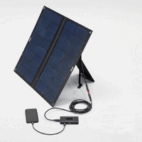
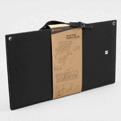
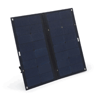
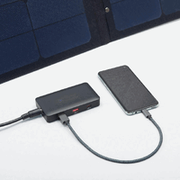
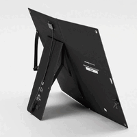
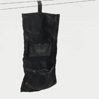

#	Alimentation solaire
:toc:
:stylesheet: ../boot-slate.css

## Utilisation d'un panneau solaire portable Décathlon 50w

L'idée est d'avoir un panneau solaire qui sorte pas uniquement du 5v/usb(-c), pour pouvoir l'utiliser pour recharger des batteries 12/13.8v.

Ici le panneau a un régulateur externe dont j'avais bon espoir qu'il soit utilisable sans ce régulateur.

## Caractéristiques techniques du panneau

* Tension à vide du panneau : 22v.
* Tension annoncée (sortie DC?) : 18v, 2.8A
* Brochage Anderson Powerpole en sortie de panneau (pas de mc4) au standard OM, ainsi le rendant compatibles avec cables et portes-fusibles du shack.
* L'intensité disponible sur les ports USB n'est pas indiquée et je ne dispose pas de quoi le mesurer.

## Utilisation avec le controlleur / régulateur d'origine

Bon ben ça marche, usb, usb-c, pas grand chose à dire. La sortie DC fournit 18-20v environ, en théorie pour charger une batterie également vendue par Décathlon.

[,console]
----
         Panneau solaire
     ┌──────────┬──────────┐
     │          │          │
     │          │          │
     │          │          │           Contrôleur
     │          │          │            d'origine
     │          │          │            ┌───────┐   Sortie
     │          │          ├────────────┤       ├─── 18v
     │          │          │            └┬─┬──┬─┘    2.8A
     │          │          │             │ │  │
     │          │          │           Sorties USB
     │          │          │
     │          │          │
     └──────────┴──────────┘
----

## Utilisation avec un controlleur de charge solaire Victron SmartSolar

41w mesurés en sortie de panneau, ~17v 2.4A, charge de la batterie Pb (vrsla) sous 13.6v 3A.
[,console]
----
         Panneau solaire
      ┌──────────┬──────────┐        Victron
      │          │          │        ┌─────┐
      │          │          │        │ 75  │
      │          │          │        │  15 │
      │          │          │        └┬─┬─┬┘
      │          │          │  Sortie │ │ │  Sortie
      │          │          ├───18v───┘ │ └──13v──
      │          │          │           │
      │          │          │         ┌─┴──────┐
      │          │          │         │ Batt   │
      │          │          │         │  VRSLA │
      │          │          │         │12v 20Ah│
      └──────────┴──────────┘         └────────┘
----

## Utilisation du Victron en déport du régulateur d'origine

A confirmer que cela fonctionne bien, je n'ai fait que des tests rapides.

[,console]
----
        Panneau solaire
     ┌──────────┬──────────┐                   Victron
     │          │          │                   ┌─────┐
     │          │          │                   │ 75  │
     │          │          │  Contrôleur       │  15 │
     │          │          │   d'origine       └┬─┬─┬┘
     │          │          │   ┌────────┐Sortie │ │ │  Sortie
     │          │          ├───┤        ├─18v───┘ │ └──13v──
     │          │          │   └┬─┬──┬──┘         │
     │          │          │    │ │  │          ┌─┴──────┐
     │          │          │  Sorties USB       │ Batt   │
     │          │          │                    │  VRSLA │
     │          │          │                    │12v 20Ah│
     └──────────┴──────────┘                    └────────┘

----

##	Alimentation d'un laptop + sdr non-usb

L'idée est d'alimenter un sdr depuis un port USB-C via un cable power-delivery afin de fournir du 12v et ainsi profiter de la batterie de l'ordi portable.
[,console]
----
         Panneau solaire
     ┌──────────┬──────────┐
     │          │          │
     │          │          │
     │          │          │           Contrôleur
     │          │          │            d'origine
     │          │          │            ┌───────┐   
     │          │          ├─────18v────┤       │
     │          │          │            └┬─┬──┬─┘
     │          │          │                  │ USB-C PD
     │          │          │             ┌────┴────┐ 
     │          │          │             │         │       ┌──────┐
     │          │          │             │ LAPTOP  ├──────►│ SDR  │
     └──────────┴──────────┘             │         │   PD  └──────┘
                                         └─────────┘
----

## Images

.Vue d'ensemble
[link=panneau-solaire-50-watts-pour-le-camping-0.jpg]

.Panneau replié
[link=panneau-solaire-50-watts-pour-le-camping-1.jpg]

.Panneau déplié
[link=panneau-solaire-50-watts-pour-le-camping-2.jpg]

.Focus sur le controlleur
[link=panneau-solaire-50-watts-pour-le-camping-3.jpg]

.Vue de l'arrière
[link=panneau-solaire-50-watts-pour-le-camping-4.jpg]

.Pochette de rangement
[link=panneau-solaire-50-watts-pour-le-camping-5.jpg]

## Liens & ressources

* https://www.decathlon.fr/p/panneau-solaire-50-watts-pour-le-camping/_/R-p-334640[Listing produit sur decathlon.fr]
* https://oh8stn.org/blog/2022/08/21/victron-75-15-mppt-rfi-problem-on-hf-receiver/[Test et suppression du QRM sur Victron 75/15 par Julian OH8STN]

## link:../[retour]
